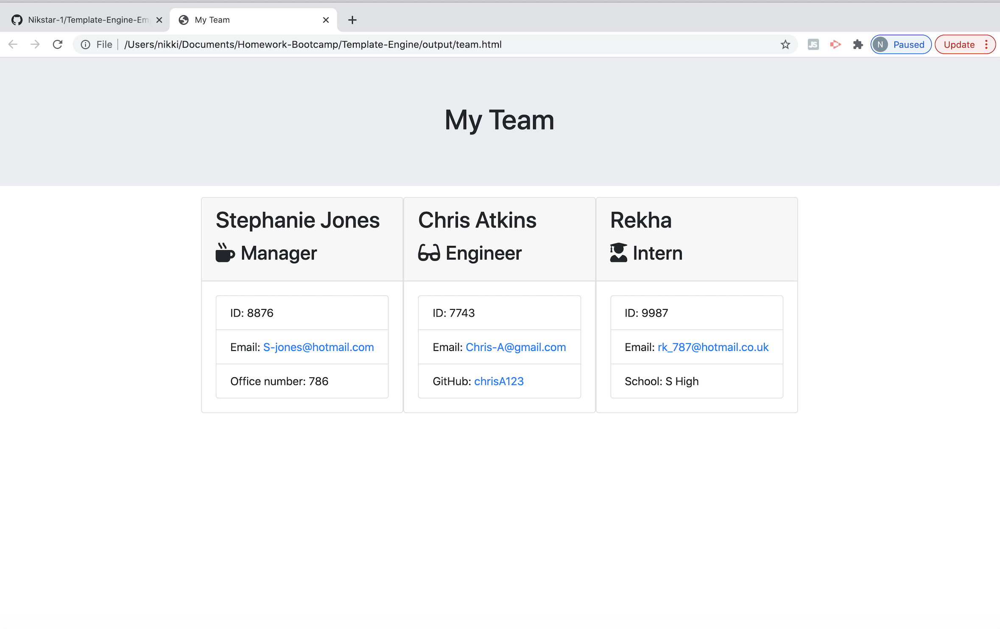

### Project Name 
Template Engine - Employee Summary

## Description
Node CLI that takes in information about employees and generates an HTML webpage that displays summaries for each person.

## Instructions
A software engineering team generator command line application. The application will prompt the user for information about the team manager and then information about the team members. The user can input any number of team members, and they may be a mix of engineers and interns.
This assignment also passes all unit tests. When the user has completed building the team, the application will create an HTML file that displays a nicely formatted team roster based on the information provided by the user. 

Following the common templates for user stories, I have been required to frame this challenge as follows:
As a manager
I want to generate a webpage that displays my team's basic info
so that I have quick access to emails and GitHub profiles

## Guidlines:
Required to use the Inquirer npm package to prompt the user for their email, id, and specific information based on their role with the company. For instance, an intern may provide their school, whereas an engineer may provide their GitHub username.

This app will run as a Node CLI to gather information about each employee.

## Screenshots:

**Template Engine - Employee Summary**

